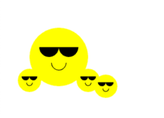

=== Drawing Sunglasses Smiley

1. Draw a smiley with sunglasses.
2. Extract the code that draws the smiley to a reusable function.
3. Draw one big smiley, surrounded by several smaller smileys--a whole family.

[source,javascript]
----
const ctx = canvasElement.getContext("2d")

const drawSmugSmiley = (ctx, x, y, headRadius) => {
  const glassRadius = headRadius / 3

  // Head
  ctx.fillStyle = 'yellow'
  ctx.beginPath()
  ctx.arc(x, y, headRadius, 0, 2 * Math.PI)
  ctx.fill()

  // Glass and mouth color
  ctx.fillStyle = 'black'

  // Left glass
  ctx.beginPath()
  ctx.arc(x - glassRadius, y - glassRadius, glassRadius, 0, Math.PI)
  ctx.fill()

  // Right glass
  ctx.beginPath()
  ctx.arc(x + glassRadius, y - glassRadius, glassRadius, 0, Math.PI)
  ctx.fill()

  // Smug smile
  ctx.beginPath()
  ctx.arc(x, y + headRadius / 5, 0.25 * headRadius, 0, Math.PI)
  ctx.stroke()
}

drawSmugSmiley(ctx, 100, 100, 50)
drawSmugSmiley(ctx, 50, 140, 20)
drawSmugSmiley(ctx, 150, 140, 20)
drawSmugSmiley(ctx, 180, 150, 20)
----

