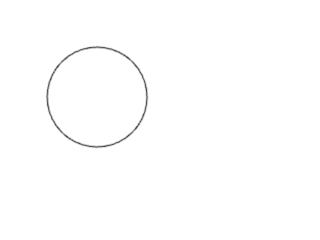

:experimental:
:stem:
:sectnums:

== Hello, world

=== HTML

Let's create a primitive, first website. It won't contain any JavaScript yet. Instead, we will create it purely with HTML. You've probably heard of HTML before: it is a simple so-called _markup_ language that is used together with CSS and JavaScript to create web sites. Since we will focus on game development with JavaScript, we won't put much focus on HTML. Nevertheless, we need a basic HTML document to load our JavaScript in the first place.

Create a new file, `index.html`, and open it in a text editor. Type the following into the file `index.html`. Don't forget to save:

[source,html]
----
<html>
  <head></head>
  <body>
      Hello, world!
  </body>
</html>
----

Open the file in the web browser. You can double-click on the file to open it with your default browser. You will see the phrase _Hello, world!_ on the screen:


That looks decent enough, but what exactly did we just write? An HTML document is a hierarchy of _elements_. Each HTML document contains at least three unique elements:

- the `<html>` element contains all other elements. 
- the `<body>` element contains everything that gets displayed on the screen.
- the `<head>` element contains everything else.

On top op this, our `index.html` document contains one _text node_, `Hello, world`. Since it is contained within the `<body>`, it gets displayed on the screen.

Let's add a new _child_ node to the `<head>` element:

[source,html]
----
<html>
  <head>
      <title>My first website</title>
  </head>
  <body>
      Hello, world!
  </body>
</html>
----

Save and reload the page. Since the new `<title>` element is not contained within the `<body>`, its contents does not appear on the screen. However, you'll find that the browser tab now contains the text within the `<title>` element:


HTML stands for Hyper Text Markup Language. Let's get started with a real programming language--JavaScript.

=== JavaScript

A `<script>` element is an HTML node that can contain JavaScript. Its contents gets executed when page is loaded. Remove the `Hello, world!` text from the `<body>`, and add a `<script>` element to `<head>`:

[source,html]
----
<html>
  <head>
    <title>My first website</title>
    <script src="/main.js" defer>
    </script>
  </head>
  <body>
  </body>
</html>
----

This element needs two _attributes_:

- `src` points to a JavaScript file.
- `defer` tells the browser that the script should be executed after the page has been loaded. It's not important to understand the reasons for why it's there, just always include it.

In your file system, next to `index.html`, create a new file `main.js` and add the following contents:

[source,javascript]
----
console.log('Hello, JavaScript!')
----

Save both files, and reload the page. Hit btn:[F12] to open the _developer tools_ and click on the menu:Console[] tab. There, you should see the message _"Hello, JavaScript!"_.


Congratulations to your very first program!

Let's examine it:

[source,js]
----
console.log('Hello, JavaScript!')
----

- `console.log()` is an instruction that prints anything within the parentheses to the console.
- The two apostrophes `''` tells you that whatever is between the apostrophes forms a so-called _string_. A string is simply a sequence of characters--a text.

From here on, only the contents of the `<script>` element will be printed out, unless `index.html` gets changed in some other way.

== Basic Syntax

We will soon draw some shapes on the screen with JavaScript, but before we can do that, we need to first familiarize ourselves with some basic syntax. Stay with me; I'll be as brief as I can.

=== Lines of Code

When a program contains multiple lines, the line gets executed in order:

[source,js]
----
console.log('Hello')
console.log('JavaScript')
----

The script above prints:

[source]
----
Hello
JavaScript
----

=== Comments

Often times, it is useful to comment your own code:

[source]
----
// My second program ❤️
console.log('Hello')
console.log('JavaScript')
----

Anything that comes after `//` is a _comment_, and does not get executed.

=== Numbers

Instead of a string, print a number:

[source,js]
----
console.log(10)
----

There are two categories of numbers: integers and floating point numbers.

- Integers are whole numbers on the numbers lines; for example, `0`, `1`, `2`, `43225`, `-1`, and `-3254`.
- Floating point numbers include some of the values between the integers; for example, `0.1`, `0.25`, `0.234343`, `3.14`, `-134.3455456`. Note that a period (`.`) is used as a decimal point--not a comma. Because there are an infinite number of rational numbers, floating points can only store a portion of them.

There are several numeric _operators_:

[source,js]
----
// Addition
console.log(5 + 2)
// Subtraction
console.log(5 - 2)
// Multiplication
console.log(5 * 2)
// Division
console.log(5 / 2)
// Remainder
console.log(5 % 2)
// Exponentiation
console.log(5 ** 2)
----

Which prints:

[source]
----
7
3
10
1
25
----

Note that you can only perform arithmetic operations with numbers. If you try the following, the code will crash because you're trying to multiply strings, which are distinct from numbers:

[source,js]
----
// Don't ❌
console.log('10' * '2')
----

You can use several operators in a single _expression_. When they are, they are assigned different precedencefootnote:[https://developer.mozilla.org/en-US/docs/Web/JavaScript/Reference/Operators/Operator_precedence], as in regular mathematics:

. Parentheses (`()`)
. Exponentiation (`**`)
. Multiplication (`*`), division (`/`), and remainder (`%`)
. Addition (`+`) and subtraction (`-`)

For example:

[source,js]
----
// Prints 7
console.log(2 * 3 + 1)
// Prints 8
console.log(2 * (3 + 1))
// Prints 50
console.log(5 ** 2 * 2)
----

Within operators of the same precedence, the language groups them by associativity:

[source,js]
----
// Same as (4 / 3) / 2; Prints 0.6666...
console.log(4 / 3 / 2)
----

When in doubt, use parenthesis to make the code easy to read:

[source,js]
----
console.log((4 / 3) / 2)
----

[#identifiers]
=== Identifiers and constants (`const`)

Imagine that two forces are applied to an object with a known mass; then you can calculate the force as such:

[source,js]
----
// a = (10 N + 5 N) / 3 kg
console.log((10 + 5) / 3)
----

This pretty quickly becomes unreadable; what do the different numbers correspond to? You can assign the values to an identifier:

[source,js]
----
const f1 = 10
const f2 = 5
const m = 3
console.log((f1 + f2) / m)
----

An identifier is a way to refer to value by a _name_--it _identifies_ a value. That makes the code much more readable. This is what happens:

. The value `10` gets stored in memory. The constant `f1` refers to this value.
. The value `5` gets stored in memory. The constant `f2` refers to this value.
. The value `3` gets stored in memory. The constant `m` refers to this value.
. The last line is executed as a sequence of the following steps:
    .. The value in `f1` gets added to `f2`, which produces a new value `15`. (There is no symbol that refers to this value.)
    .. The calculated value `15` gets divided by the value that is stored in `m`, which produces the value `5`.
    .. The value `5` is passed to `console.log()`, which prints out the value in the console.

The names above are acceptable in a small program, but in a larger program--where there easily could be dozens of different identifiers--such short names could easily be confused with one another. Programmers tend to prefer more descriptive names:

[source,js]
----
const forceEngine = 10
const forceDrag = 5
const mass = 3
console.log((forceEngine + forceDrag) / mass)
----

The identifiers adhere to a special naming convention called `camelCase`footnote:[https://en.wikipedia.org/wiki/Camel_case]. An identifier cannot have a space in it--that would be interpreted as two separate symbols. Therefore, to name a word with multiple words, capitalize all words except the first one, and concatenate them.

NOTE: there are other popular naming conventions; for example, Pascal case (`ForceEngine`), kebab case (`force-engine`), and snake case (`snake-case`). They work under different circumstances and have different popularity in different programming languages. For example, kebab case is popular for URLs (including file names), but does not work in JavaScript, where the hyphen (`-`) would be interpreted as a subtraction operator. Pascal case works in JavaScript, but is only used in special circumstances which are covered further down the road in this book.

=== Runtime Errors

Execute the following statement:

[source,js]
----
console.log('hello')
----

That prints out the string `'hello'`.

Try to print just `hello` without the apostrophes:

[source,js]
----
console.log(hello)
----

This leads to a common error:

> Uncaught ReferenceError: hello is not defined at index.html

Let's break down the error message:

- _"Uncaught"_: this means that an error occurred, but was never handled, which caused the program to crash.
- _"`ReferenceError`"_: the type of the error.
- _"hello is not defined"_: the program tried to
- _"at index.html"_: the place where the error occurred.When the program grows into many files, this will point to the exact point where the error occurred.

The key phrase here is _"hello is not defined"_. When `hello` is not surrounded by apostrophes, the browser interprets it as an _identifier_.Since there is no identifier with the name `hello`, the program crashes.

Reading error messages is an important skill, as you will encounter many of them as you develop software.


=== Template Strings (Template Literals)

Template stringsfootnote:[https://developer.mozilla.org/en-US/docs/Web/JavaScript/Reference/Template_literals] allow you to join smaller strings into larger ones. They look like regular strings, but they start and end with backticks (```) instead of apostrophes (`''`). To include another string inside a template string, write:

[source,js]
----
const name = 'Johannes'
console.log(`Hello, ${name}`)
----

The code that you put within the curly braces `${}` will be joined with the rest of the contents. It can be done repeatedly; for example:

[source,js]
----
const firstName = 'Werner'
const lastName = 'Heisenberg'
const name = `${firstName} ${lastName}`
console.log(`Hello, ${name}! Your first name is "${firstName}", and your last name is "${lastName}".`)
----

prints the following to console:

[source]
----
Hello, Werner Heisenberg! Your first name is "Werner", and your last name is "Heisenberg".
----


// TODO numbers in strings

== Functions and Procedures

// TODO intro

=== Procedures

As you construct a programs of any notable size, you will need to break up the code into smaller units. For example, to spawn 100 enemies, you don't want to repeat the code that spawns one enemy 100 times. A _procedure_ is a re-usable piece of code, and it looks like:

[source,js]
----
() => {
  // Re-usable code here
}
----

A procedure can be _called_, which means that the code within curly braces (`{}`) gets executed. For example, the following procedure will print _"Hello, procedure!"_.

[source,js]
----
() => {
  console.log('Hello, procedure!')
}
----

However, if you simply include this in `main.js`, nothing will happen. That is because you defined the procedure, but you never _called_ it. To call a procedure is to run the code within it. The statement above defines a code snipped that will run, but it never executes it. To call it, you first need an identifier that references the procedure. Then, write the name of the identifier followed by parentheses (`()`):

[source,js]
----
// Define the procedure
const greet = () => {
  console.log('Hello, procedure!')
}
// Call the procedure
greet()
----

That should print out the string to the console one time. Now, you can call the procedure multiple times:

[source,js]
----
// Define the procedure
const greet = () => {
  console.log('Hello, procedure!')
}
// Prints "Hello, procedure!" four times
greet()
greet()
greet()
greet()
----


The name `greet` is just a way to refer to the value on the right hand side of the equals sign (`=`). You can assign the same procedure to multiple identifiers; for example, this prints the same string twice:

[source,javascript]
----
// Define the procedure
const greet = () => {
  console.log('Hello, procedure!')
}
// greet2 refers to the same procedure as greet
const greet2 = greet
// Call the same procedure twice
greet()
greet2()
----

=== Block Scope

In a procedure, the code within curly braces (`{}`) forms a _block_. A block has access to the identifiers that were declared outside of that block; but the identifiers that were declared inside a block are not visible outside of it.

[source,js]
----
const name = "Heisenberg"
const sayMyName = () => {
  console.log(`You're ${name}`)
}
sayMyName()
----

[source,js]
----
const firstName = 'Werner'
const sayMyName = () => {
  const lastName = "Heisenberg"
  // Ok ✅
  console.log(`You're ${firstName} ${lastName}`)
}
sayMyName()
// Error ❌
console.log(`You're ${firstName} ${lastName}`)
----


The final line in the example throws an error, because `lastName` is not accessible outside the procedure; `lastName` is not within scope of the last line.

=== Arguments

As demonstrated in the previous section, you can pass values to a procedures by declaring the identifier above the procedure. This is often useful, but other times, you want to be able to pass different values; in the example in the previous section, you might want to be able to pass different names.

You might have noticed that the syntax for calling a procedure is similar to the `log()` in `console.log()`. That is because `log` _is_ a procedure. The value that appears between the parentheses is called and _argument_, and can be defined as such:

[source,javascript]
----
const sayMyName = (name) => {
  console.log(`You're ${name}!`)
}
sayMyName("Heisenberg")
sayMyName("the man")
----

This will print

[source]
----
You're Heisenberg!
You're the man!
----

A procedure can take multiple argument, which are separated by commas (`,`):

[source,javascript]
----
const sayMyName = (firstName, lastName) => {
  console.log(`You're ${firstName} ${lastName}!`)
}
sayMyName("Werner", "Heisenberg")
----

This will print

[source]
----
You're Werner Heisenberg!
----

=== Functions

A mathematical function is something that takes an input and produces an output. For example, a function stem:[f(x) = 10x] gives 10 times the amount for a given stem:[x].

// TODO infographics

In JavaScript, a function is a procedure that _returns_ one value as output. For example:

[source,javascript]
----
const circleArea = (radius) => {
  return 3.14159 * radius ** 2
}
----

Everything after the `return` keyword is the output of the function. When the function is called, it will _evaluate_ to the returned value; just like a numeric expression evaluates to a number (`5 * 2` evaluates to `10`), a function evaluates to the returned value. Here is an example:

[source,javascript]
----
const circleArea = (radius) => {
  return 3.14159 * radius ** 2
}
// Assign the area of a circle with radius 5 to a constant
const myCircleArea = circleArea(5)
// Log the area of a circle with radius 10
console.log(circleArea(10))
// Calculate the area of a ring with diameter 8 and radius 6
const ringArea = circleArea(10) - circleArea(10)
----

== Objects

Often times, you will have data that is related. For example, a player might have a name, a position, velocity, health, and so on:

[source,javascript]
----
const name = 'John Doe'
const health = 50
const maxHealth = 100
const positionX = 0
const positionY = 0
const velocityX = 0
const velocityY = 0
----

If there are two players, you might need to rename the identifiers above, so that you don't get naming collisions:

[source,javascript]
----
const player1Name = 'John Doe'
const player1Health = 50
const player1MaxHealth = 100
const player1PositionX = 10
const player1PositionY = -3
const player1VelocityX = 0.5
const player1VelocityY = 0.25
----

Clearly, the variable names get very long and annoying to read.

Passing this data around also becomes tedious. For example, a function that calculates where the player is moving in three dimensions might need the following arguments:

[source,javascript]
----
// Don't ❌
const nextPosition = (
  positionX,
  positionY,
  positionZ,
  velocityX,
  velocityY,
  velocityZ,
) => {
  // Implementation details...
}

const player1NextPos = nextPosition(
  player1PositionX,
  player1PositionY,
  player1PositionZ,
  player1VelocityY,
  player1VelocityY,
  player1VelocityZ,
)
----
.Can you spot the error?

The number of argument become to numerous, so it gets difficult to identify which is which.

Rather than storing these values in individual identifiers, group the data with _objects_:

[source,javascript]
----
const player1 = {
  name: 'Werner Heisenberg',
  health: 50,
  maxHealth: 200,
  positionX: 10,
  positionY: -3,
  velocityX: 0.5,
  velocityY: 0.25,
}
----

An object is defined with an opening curly brace (`{`), followed by a comma-separated list of properties, and closed with a closing curly brace (`}`)footnote:[https://developer.mozilla.org/en-US/docs/Web/JavaScript/Reference/Operators/Object_initializer]. A property consists of a property name, followed by a colon (`:`), and an associated value. In the example above, everything after the equal sign (`=`) is an object, and `health` is a property with the value `50`.

Read values from the object with a period (`.`), followed by the property name:

[source,javascript]
----
// Prints "Werner Heisenberg"
console.log(player1.name)

// Prints "Health: 25%"
const healthPercent = 100 * player1.health / player1.maxHealth
console.log(`Health: ${healthPercent}%`)
----

With the object, the word _player1_ only appears a single time, but the words _position_ and _velocity_ are still repeated twice. An object is a value; just like numbers, strings, and functions; and can be used as property values as such:

[source,javascript]
----
const player1 = {
  name: 'Werner Heisenberg',
  health: 50,
  maxHealth: 200,
  position: {
    x: 10,
    y: -3,
  },
  velocity: {
    x: 0.5,
    y: 0.25,
  },
}
----

To access these nested properties, just use the dot notation twice:

[source,javascript]
----
console.log(`x-position: ${player1.position.x}`)
----

Note that the curly braces (`{}`) in the object have nothing in common with the curly braces in functions. A function can return an object as such:

[source,javascript]
----
// This curly brace denotes a function body
const createVector = (x, y) => {
  // These curly braces denotes an object
  return {
    x: x,
    y: y,
  }
}
----

You might notice now that the dot notation appears in `console.log()`. `console` is an object with a property `log`. This property contains the function that you've been using so frequently. You can think of `console` as being declared like this:

[source,javascript]
----
const console = {
  log: (message) => {
    // Implementation
  },
}
----

The reason why you can access `console` without having this statement anywhere is that `console` is a special object that is accessible from anywhere--it has a __global__ scope.

[TIP]
====
Try to log the `console` object and see what you get:

[source,javascript]
----
console.log(console)
----
====

== Canvas

With the basic concepts from the previus chapter, you are now equipped to start drawing things on the screen.

=== Creating elements

In the first chapter, you saw that a web page consists of different elements, and that elements that are presented on the screen are placed within the `<body>` element. Most websites consists of a hierarchy of boxes and characters; so they contain elements like buttons, headings, and paragraphs; each one of these has a corresponding HTML tag (`<button>`, `<h1>`, and `<p>` respectively). This model is called the _box model_, which works well for many types of applications, but video games need more flexibility. The `<canvas>` element allows you to draw anything you like on a 2-dimensional surface. So except for one `<canvas>`, our game does not need any other HTML elements in the `<body>`.

You _could_ add a `<canvas>` element directly to `index.html` as such:

[source, html]
----
<html>
  <head>
      <title>My first website</title>
  </head>
  <body>
      <canvas></canvas>
  </body>
</html>
----

But to draw on it, you need a reference to the element in JavaScript. So instead, create the element in JavaScript and add it to the `<body>`:
[source,js]
----
const canvasElement = document.createElement('canvas')
----

[#global-objects]
Just like `console`, `document` is another global object that is available from anywhere. It has a property called `createElement`, whose value is a function that accepts one argument and returns a new element. Think of it this way:

[source,javascript]
----
// Pseudo-code
const document = {
  createElement: (tag) => {
    return // create element here
  }
}
----

So `document.createElement` gives a function, and `document.createElement('canvas')` calls that function. The result is an HTML `<canvas>` element, but the result is not automatically added to the `<body>`, so it remains hidden from view. The document contains a second function that lets you add the result from `createElement` to the `<body>`:

[source,javascript]
----
const canvasElement = document.createElement('canvas')
document.body.appendChild(canvasElement)
----

The `document` represents the entire web page; think of it as representing the  `<html>` element in the `.html` file. Since an HTML document must contain _exactly one_ `<body>` element, you can access it via `document.body`. `body` is another object, which contains a property with the name `appendChild`, which adds the argument to the screen.

Save the file and reload the page. Open the developer tools with btn:[F12] and click on the menu:Elements[] tab. You will see that the `<body>` now contains a `<canvas>` element, but it's invisible in the view. When you hover the element with your cursor, the browser will highlight the element in the view. The canvas is in the view, but it just has the same color as the `<body>` background:


All future programs are going to start with these lines of code.

=== Drawing Rectangles

The moment of truth is here; draw a rectangle on the `<canvas>`:

[source,js]
----
const canvasElement = document.createElement('canvas')
document.body.appendChild(canvasElement)

const ctx = canvasElement.getContext("2d")
ctx.fillRect(20, 20, 150, 100);
----

_Et voilà!_

image::html-canvas-rectangle.png[]

The `getContext()` functionfootnote:[https://developer.mozilla.org/en-US/docs/Web/API/HTMLCanvasElement/getContext] returns an object that lets you draw shapes on the canvas. This object is assigned to a constant `ctx`, so that it can be referenced again. One of these functions is `fillRect()`footnote:[https://developer.mozilla.org/en-US/docs/Web/API/CanvasRenderingContext2D/fillRect], which draws a rectangle on the screen. The first two argument it takes are the stem:[x]- and stem:[y]- coordinates of the rectangle's upper left corner. The last two coordinates are the width and heights.

NOTE: The name `ctx` is just an arbitrary name; it could have been named `context` or anything else.

=== Computer Graphics Coordinate Systems

To better understand how the coordinate systems in computer graphics work, set the stem:[x]- and stem:[y]- coordinates to `0`:

[source,js]
----
const canvasElement = document.createElement('canvas')
document.body.appendChild(canvasElement)

const ctx = canvasElement.getContext("2d")
ctx.fillRect(0, 0, 150, 100);
----

That positions the rectangle in the top-left corner:


In computer graphics, _origin_ (the stem:[(0, 0)] coordinate) is positioned in the top-left corner. The positive stem:[x]-direction is to the right, but the positive stem:[y]-direction is pointing downward.


At first, this might seem odd--mathematicians has the stem:[y]-axis pointing upwards. However, both are just arbitrary convention, and you will quickly get used to either one.

[NOTE]
====
As it turns out, this is for historical reasons. When computer graphics became a thing, monitors were made with cathode-ray tubes (CRTs)footnote:[https://en.wikipedia.org/wiki/Cathode-ray_tube]. These tubes would emit electron beams on a phosphorescent screen. When the beam hit the screen, it would light up and mark a pixel. To draw multiple pixels, the beam would sweep across the screen. As it so happens, the standard became that the beam would start in the top-left corner, sweep to the right, jump back to the left side, jump down a pixel, and repeat for the whole screen surface.

.An electron beam sweeping across a CRT television.

====

=== Fullscreen

The black rectangle is not positioned exactly in the top-left corner of the screen--there are 8 pixels of margin. Open the dev tools with btn:[F12], open the menu:Elements[] tab, and select `<body>`. Depending on your web browser, you can see that the body has 8 pixels of _margin_ by default. In `main.js`, update the body's the `style` attribute:

[source,js]
----
const canvasElement = document.createElement('canvas')

document.body.style.margin = '0px'
document.body.appendChild(canvasElement)

const ctx = canvasElement.getContext("2d")
ctx.fillRect(0, 0, 150, 100);
----

That removes the margin:


NOTE: Even when the `<body>` element didn't explicitly specified any styles, the browser added a default margin of 8 pixels. In the early days of the internet, the browser vendors decided to add this margin by default to all `<body>` elements. Now, existing websites rely on this feature, so it cannot be undone.

Move the rectangle sideways and downwards, by incrementing the stem:[x]- and stem:[y]-values:

[source,js]
----
const canvasElement = document.createElement('canvas')

document.body.style.margin = '0px'
document.body.appendChild(canvasElement)

const ctx = canvasElement.getContext("2d")
ctx.fillRect(200, 100, 150, 100);
----

The rectangle moved, but it also seemingly shrunk. Under menu:dev tools[Elements], select the `<canvas>` element: you'll see that the rectangle has simply moved outside the edge of the `<canvas>` element, because the `<canvas>` does not cover the whole screen:


The `<canvas>` element has the two properties `width` and `height` that determines the dimensions of the canvas. Set these to be the same as the dimensions of the `<body>` element:

[source,javascript]
----
const canvasElement = document.createElement('canvas')
canvasElement.width = document.body.clientWidth
canvasElement.height = document.body.clientHeight

document.body.style.margin = '0px'
document.body.appendChild(canvasElement)

const ctx = canvasElement.getContext("2d")
ctx.fillRect(500, 500, 150, 100)
----

Now that the canvas is full-screen, the rectangle can be placed anywhere in the view:


=== Drawing Lines Along Paths (Stroke)

`fillRect` is convenient, because lets you draw a rectangle in a single function call. However, to draw other shapes, you need to use __paths__footnote:[https://developer.mozilla.org/en-US/docs/Web/API/Canvas_API/Tutorial/Drawing_shapes#path2d_objects]. A path is a list of points, connected by segments of lines that can be of different shapes.

You can draw one line at the time.

. Begin a new path by calling `ctx.beginPath()`.
. Add the first point to the path with `ctx.moveTo()`. You can think of this function call as "putting down the pen against the canvas".
. Insert the next point on the path with `ctx.moveTo()`.
. Repeat the step above if you want to add more line segments in the path.
. Draw a line on the canvas along the path by calling `ctx.stroke()`.

[source,javascript]
----
const canvasElement = document.createElement('canvas')
canvasElement.width = document.body.clientWidth
canvasElement.height = document.body.clientHeight

document.body.style.margin = '0px'
document.body.appendChild(canvasElement)

const ctx = canvasElement.getContext("2d")

// Add a path to ctx
ctx.beginPath()
// Set the first point of the path
ctx.moveTo(100, 100)
// Connect the first point to (200, 200)
ctx.lineTo(200, 200)

// Draw the path
ctx.stroke()
----


// TODO change color

You can change the color and thickness with `strokeStyle` and `lineWidth` respectively:

[source,javascript]
----
const ctx = canvasElement.getContext("2d")

ctx.beginPath()
ctx.moveTo(100, 100)
ctx.lineTo(200, 200)

ctx.lineWidth = 14;
ctx.strokeStyle = "green";
ctx.stroke()
----

.A thick, green line.


As an exercise, draw a colored arrow:

[source,javascript, #first-arrow-on-canvas]
----

const ctx = canvasElement.getContext("2d")

// Add a path to ctx
ctx.beginPath()

// Arrow shaft
ctx.moveTo(100, 100)
ctx.lineTo(200, 100)

// Arrowhead
ctx.moveTo(200, 100)
ctx.lineTo(200 - 30, 100 - 30)
ctx.moveTo(200, 100)
ctx.lineTo(200 - 30, 100 + 30)

// Stroke along the path
ctx.stroke()
----


=== Filling Polygons

`ctx.closePath()` adds a line between the first point on the path and the last one. For example, the following path defines a rectangle:

[source,javascript]
----
const ctx = canvasElement.getContext("2d")

// Add a path to ctx
ctx.beginPath()

// Rectangle

// Point to top-left corner
ctx.moveTo(100, 100)
// Continue to the top-right corner: top side
ctx.lineTo(200, 100)
// Continue to the bottom-right corner: right side
ctx.lineTo(200, 200)
// Continue to the bottom-left corner: bottom side
ctx.lineTo(100, 200)
// Return to the top-left corner: left side
ctx.closePath()

// Stroke along the path
ctx.stroke()
----


This path forms a polygon, which can be filled with `ctx.fill()`. Simply replace `ctx.stroke()` with `ctx.fill()`:


[source,javascript]
----
// Instead of ctx.stroke()
ctx.fill()
----

.Oh, a black box... Is it a function?


Change the color with `fillStyle` (note that this property is distinct from `strokeStyle`):

[source,javascript]
----
ctx.fillStyle = 'blue'
ctx.fill()
----

.A blue box
image::rectangle-blue.png[]

=== Drawing Circles and Arcs

With paths, you can draw any imaginable shape, including circles. You _could_ achieve that by calculating evenly spaced coordinates on the circle, and drawing a path between them. For example, a circle with 10 such lines could look like:


Conveniently though, `ctx` already provides a function for drawing circles, called `ctx.arc()`footnote:[https://developer.mozilla.org/en-US/docs/Web/API/CanvasRenderingContext2D/arc]. This function creates a path alongside an arch.

Unlike `ctx.rect()`, `ctx.arc()` uses the first two arguments (stem:[x]- and stem:[y]-coordinates) to define the arc's center. The third argument is the length, and the final two arguments are the starting- and ending angles. Since a circle is just an arc that spans 360°, provide stem:[0] and stem:[2pi] as arguments.

NOTE: All trigonometric functions in JavaScript uses radians--not degrees.

[source,javascript]
----
const ctx = canvasElement.getContext("2d")

// Add a path to ctx
ctx.beginPath()
// Circle
ctx.arc(100, 100, 50, 0, 3.14159 * 2)
// Stroke along the path
ctx.stroke()
----



== Refactoring--Extraction

_Refactoring_ is the process of restructuring code without changing its behavior. The main purpose of refactoring is to make the code easier to understand. This chapter will explore a key refactoring technique called _extraction_, which will help you scale your application.

The code for <<first-arrow-on-canvas, drawing the arrow>> contains a lot of numbers--many of which are duplicates. Let's refactor the code so that it doesn't repeat the coordinates. The arrow stretches between two points; from the tip, to the base:

[source,javascript]
----
const baseX = 100
const baseY = 100

const tipX = 200
const tipY = 100
----

But the tip's coordinates could be derived from the base's, if only the length of the arrow is known:

[source,javascript]
----
const baseX = 100
const baseY = 100
const length = 100

const tipX = baseX + length
const tipY = baseY
----

There's also the size arrowhead, which currently is offset stem:[30\ "px"] in both stem:[x]- and stem:[y]-direction. This corresponds to stem:[3/10] of the shaft's length:

[source,javascript]
----
const arrowHeadSize = 3 / 10
const arrowheadOffset = arrowHeadSize * length
----

Now, insert these constants into the <<first-arrow-on-canvas, arrow example>>:

[source,javascript]
----
// Add a path to ctx
ctx.beginPath()

// Arrow shaft
ctx.moveTo(baseX, baseY)
ctx.lineTo(tipX, tipY)

// Arrowhead
ctx.moveTo(tipX, tipY)
ctx.lineTo(tipX - arrowheadOffset, tipY - arrowheadOffset)
ctx.moveTo(tipX, tipY)
ctx.lineTo(tipX - arrowheadOffset, tipY + arrowheadOffset)

// Stroke along the path
ctx.stroke()
----

The final result looks the same, is a little bit longer, but is _significantly_ easier to understand.

Now that the arrow derives all coordinates from just four arguments--`baseX`, `baseY`, `length`, and `arrowHeadSize`)--it becomes trivial to do even more refactoring.

Extraction is a refactoring technique that involves moving pieces of code into a new function or procedure. That makes the extracted code reusable, and the original code becomes easier to comprehend.

Before refactoring the code for drawing the arrow, let's consider a shorter example that calculates the Earth's gravitational force on its surface in accordance with Newton's law of universal gravitationfootnote:[https://en.wikipedia.org/wiki/Newton%27s_law_of_universal_gravitation]:

stem:[F=G{m_1m_2}/r^2]

[source,javascript]
----
const gravitationalConstant = 6.674e-11
// A person's weight
const m1 = 100
// Earth's mass
const m2 = 5.9722e24
// The distance to the earth's core
const r = 6.378e6
// Surface-level gravitational force on person of 100 kg
const force = gravitationalConstant * m1 * m2 / (r ** 2)
----

TIP: Numbers can be written with scientific notation; for example, `3.14e-3`.

If the calculation is moved to a return statement within a function, calling that function is equivalent:

[source,javascript]
----
const earthForce = () => {
  const gravitationalConstant = 6.674e-11
  const m1 = 100
  const m2 = 5.9722e24
  const r = 6.378e6
  // Surface-level gravitational force on person of 100 kg
  return gravitationalConstant * m1 * m2 / (r ** 2)
}
const force = earthForce()
----

Finally, the extracted function can be made re-usable by moving some of the constants into function arguments:

[source,javascript]
----
const earthForce = (mass) => {
  const gravitationalConstant = 6.674e-11
  const m2 = 5.9722e24
  const r = 6.378e6
  // Surface-level gravitational force on an object
  return gravitationalConstant * mass * m2 / (r ** 2)
}
  // Surface-level gravitational force on person of 100 kg
const force = earthForce(100)
----

It's easy to see how other values in the calculation can be _parameterized_ in the same way; for example `r`.

Take the <<first-arrow-on-canvas, example with the arrow>>, and move the code that draws the path to a reusable function.

[source,javascript, #refactored-arrow-on-canvas]
----

const ctx = canvasElement.getContext("2d")

const drawArrow = (baseX, baseY, length) => {
  const tipX = baseX + length
  const tipY = baseY

  const arrowHeadSize = 3 / 10
  const arrowheadOffset = arrowHeadSize * length

  // Add a path to ctx
  ctx.beginPath()

  // Arrow shaft
  ctx.moveTo(baseX, baseY)
  ctx.lineTo(tipX, tipY)

  // Arrowhead
  ctx.moveTo(tipX, tipY)
  ctx.lineTo(tipX - arrowheadOffset, tipY - arrowheadOffset)
  ctx.moveTo(tipX, tipY)
  ctx.lineTo(tipX - arrowheadOffset, tipY + arrowheadOffset)

  // Stroke along the path
  ctx.stroke()
}
----

NOTE: the `drawArrow()` can access `ctx` because it was declared after `ctx`. If `drawArrow` was declared in a separate file, it would also have to receive `ctx` as an argument.

Use this function to draw three arrows of different sizes:

[source,javascript]
----
// Draw three arrows of different sizes
drawArrow(125, 50, 50)
drawArrow(100, 100, 100)
drawArrow(50, 200, 200)
----


== Animations

To make objects move on the screen, a computer draws a series of still images one-by-one on the screen over time. Drawing them in rapid succession--at least 30 times per second--gives the illusion of continuous motion. Each still image is called a _frame_.

TIP: The term _frame per second_ (stem:[fps]) comes from the word frame in this context.

You task in this chapter is to crate a circle that moves across the screen.

=== Animation Loop

The objective is to draw a rapid succession of still images. The algorithm looks something like:

1. Draw still image
2. Wait a fraction of a second
3. Repeat step #1

It's easy to imagine a function that would delay the execution for a whole (step #2), but how can a program repeat itself?

Create a function `loop` that prints the current time with `Date()`.

[source,javascript]
----
const loop = () => {
  console.log(Date())
}
----

Then call `setInterval`:

[source,javascript]
----
const loop = () => {
  console.log(Date())
}
setInterval(loop, 1000)
----

Note that `loop` is written without parentheses. `setInterval` receives a reference to the procedure, which it will call repeatedly with regular intervals. If you called `loop` before passing it in, `setInterval` would not receive a reference to the procedure, but the value that the procedure returns. Since procedures do not return values, this would result in an error.

The second argument determines how long the period is in milliseconds. In the example above, `loop` gets called once per second for eternity, which means that you will see the current time getting printed out to the console every second.

=== Mutation (Change)

Since the task is to create a circle that is moving across the screen, you are going to need to calculate a new coordinate every few milliseconds. But so far, each example has either demonstrated static images or `console.log()` statements that always prints out the same result. Apart from the timer, nothing has ever really _changed_ once the website has loaded. In programming, _change_ is more often than not referred to as _mutation_.

Consider a constant:

[source,javascript]
----
// Start position is at 0
const positionX = 0
----

The word `const` implies that the position is constant; that is, it never changes. You can see it as a mathematical equation:

stem:[x = 0]

An equation is a statement that the two expressions on either side are equal--there is no way to change stem:[x].

In an expression such as this:

[source,javascript]
----
console.log(10 + 2)
----

`10` and `2` are values, but after they have gone into the `+` operator, there is no way to refer to them again. Constants are a way to refer to values by a name--an identifier.

The `let` keyword, however, is an alternative to `const` that creates a _variable_. A variable, as the name implies, lets you change the value that it refers to:

[source,javascript]
----
let positionX = 0
// Prints 0
console.log(positionX)

position = 10
// Prints 10
console.log(positionX)
----

When you create a variable, you must write `let` before the name. After that, you can _assign_ new values with the _assignment operator_ (`=`).

NOTE: Confusingly, there is also a `var` keyword for variables. It gets easier if you completely avoid using this keyword because it has some nuances to it. However, there is a lot of older JavaScript examples our there that does use it, so now you know.

The following yields a syntax error because it attempts to reassign a constant:

[source,javascript]
----
const positionX = 0
// Syntax error ❌
positionX = 10
----

You must not write `let` again before the variable name:

[source,javascript]
----
let positionX = 0
// Syntax error ❌
let positionX = 10
----

It's common to use the variable name on both sides of the assignment operator (`=`):

[source,javascript]
----
let positionX = 10
positionX = positionX + 20
// Prints 30
console.log(positionX)
----

How it works:

1. The expression on the right hand side of the assigment operator (`=`) is calculated. At this point in time, `positionX` is `10`, so the result of the addition is `30`.
2. The value from the expression on the right hand side is assigned to the variable on the left side. `positionX` is reassigned to the value `30`.

=== Animating

With `setInterval` and variables (`let`) as new tools in your tool belt, print out the x-coordinate for a target that is moving in the right direction:

[source,javascript]
----
// Start position
let positionX = 100
const loop = () => {
  positionX = positionX + 1
  console.log(positionX)
}
setInterval(loop, 1000)
----

The output in the console will look like:

[source]
----
101
102
103
104
105
----

And so on... once per second until the end of time.

Instead of printing out a boring number, let's use it as a coordinate when drawing out a circle:

[source,javascript]
----
const ctx = canvasElement.getContext("2d")

let positionX = 0

const loop = () => {
  positionX = positionX + 100

  ctx.beginPath()
  ctx.arc(positionX, 100, 50, 0, 2 * Math.PI)
  ctx.fill()
}
setInterval(loop, 1000)
----


That hardly counts as an animation! The dot is not moving smoothly, but jumps from position to position. And when a dot is drawn out, the previous dots are kept on the canvas.

The fix is simply to

1. Reduce the delay--the second argument in `setInterval`.
2. Before drawing a frame, paint over the previous one with the background color.

[source,javascript]
----
const ctx = canvasElement.getContext("2d")

let positionX = 0

const loop = () => {
  positionX = positionX + 2

  // Clear the canvas
  ctx.fillStyle = 'white'
  ctx.fillRect(0, 0, canvasElement.width, canvasElement.height)

  // Draw circle
  ctx.beginPath()
  ctx.arc(positionX, 100, 50, 0, 2 * Math.PI)
  ctx.fillStyle = 'black'
  ctx.fill()
}
setInterval(loop, 1000 / 60)
----

=== Refactoring--Single Responsibility Principle

The `loop` function does two things:

1. Runs the next step in the game world simulation. At the moment, this entails just the stem:[x]-coordinate of a moving circle, but there will be more to come.
2. Draws the world on the screen.

At the moment, the code is ok, but as the program grows, it will become increasingly difficult to keep track of all the lines of code. A good practice is to identify when a procedure does more than one thing, and to divide that into sub-procedures. This is called the _single responsibility principle_footnote:[https://en.wikipedia.org/wiki/Single_responsibility_principle].

Let's put that in practice by <<_refactoring_extraction, _extracting_>> the parts that handles the 1) and 2):

[source,javascript]
----
const ctx = canvasElement.getContext("2d")

let positionX = 0

// Update game world physics
const update = () => {
  positionX = positionX + 2
}

// Draw the game world
const render = () => {
  // Clear the canvas
  ctx.fillStyle = 'white'
  ctx.fillRect(0, 0, canvasElement.width, canvasElement.height)

  // Draw circle
  ctx.beginPath()
  ctx.arc(positionX, 100, 50, 0, 2 * Math.PI)
  ctx.fillStyle = 'black'
  ctx.fill()
}

const loop = () => {
  update()
  render()
}


setInterval(loop, 1000 / 60)
----

To be perfectly clear: this is totally overkill at the moment, but this will be useful very soon as the program grows.

=== Units of Measurement

One obvious flaw with the code is that the game will speed up or slow down if you change the delay between each frame. For example, by decreasing the frame rate from 60 fps to 30 fps, the entire game will slow down by a factor of stem:[0.5].

.By halving the frame rate, the `2` in the example would have to be replaced with a `4`; otherwise, the animation would slow down. Imagine such a change in a larger code base, with hundreds of such values.
[source,javascript]
----
// Update game world physics
const update = () => {
  positionX = positionX + 2
}

// This causes the entire game to slow down by 50%.
setInterval(loop, 1000 / 30)
----

Let's be more explicit with the units in the calculation. A frame rate of 60 fps means that the time between each frame is stem:[1/60] second.

[source,javascript]
----
const fps = 60
const dt = 1 / fps
----

`dt` stands for _delta time_; that is, the time difference between each frame. To calculate the _delta distance_--the number of pixels that the circle is moving each frame--multiply the delta time with the velocity:

[source,javascript]
----
const ctx = canvasElement.getContext("2d")

const fps = 60
const dt = 1 / fps

let positionX = 0
// 50 pixels per second
const velocityX = 50

const update = () => {
  positionX = positionX + velocityX * dt
}
----

Now, you can decrease the framerate without affecting the speed by which the circle is moving.

=== Measuring Frame Rate

If you've played video games, you must have noticed that the frame rate is _not_ a constant number, but that during heavy calculations, it tends to drop. In the previous section, the delta time (`dt`) was calculated from a _desired_ frame rate, so that the velocity of the circle was the same regardless of the frame rate. But there is no guarantee that the computer will be able to deliver the frame rate that you set. For a concrete example, try yourself to set the frame rate to `1000` and see what happens: despite the effort in the previous section to create a constant speed, the game slows down because JavaScript's `setInterval` can not handle very short intervalsfootnote:[https://developer.mozilla.org/en-US/docs/Web/API/setTimeout#reasons_for_delays_longer_than_specified].

The solution is to calculate the delta time (`dt`) for each frame based on the actual time that elapsed:

stem:[dt = t_"now" - t_"then"]

Where does stem:[t_"now"] and stem:[t_"then"] come from? The function  `performance.now()` gives the number of milliseconds since the web page was loaded. For example, this is how you can measure the time it takes to perform a certain computation:

.An example of how to measure time. Note that `performance.now()` has a precision of microseconds, but none of the programs that you have written so far takes more than a microsecond to execute, which means that `dt` will become 0. Modern processors are fast!
[source,javascript]
----
const timeThen = performance.now()
// Peform some computation here
doSomething()
const timeNow = performance.now()
const dt = (timeNow - timeThen) / 1000
----

When the program starts, save the time from `performance.now()` in a variable, `timeThen`:

[source,javascript]
----
let timeThen = performance.now()

const update = () => {
  positionX = positionX + velocityX * dt
}
----

For each frame (in `update()`), calculate the current time with `performance.now()`, and call it `timeNow`. Now you can calculate the time that elapsed since the program started:

[source,javascript]
----
let timeThen = performance.now()

const update = () => {
  const timeNow = performance.now()
  console.log(`Time since the program started: ${timeNow - timeThen} ms`)
  positionX = positionX + velocityX * dt
}
----

If you set assign the value in `timeNow` to `timeThen`, at the beginning of the next frame, `timeThen` will contain the time stamp of the previous frame. This means that `dt` can be calculated by just subtracting `timeThen` from `timeNow`:

[source,javascript]
----
// Initialize timeThen to the time when the program started
let timeThen = performance.now()

const update = () => {
  // timeNow contains the timestamp for the current frame
  const timeNow = performance.now()
  // timeThen contains the timestamp for the previous frame
  const dt = (timeNow - timeThen) / 1000
  // Put the current time stamp in the variable, so that we can calculate dt again next frame
  timeThen = timeNow

  positionX = positionX + velocityX * dt
}
----

With this in place, try to set `fps` to `1000`: you won't actually get `1000` frames per second, but the animation won't slow down.

=== Optimized Frame Rate

According to the HTMl specification, `setInterval` has a minimum delay of 4 msfootnote:[https://developer.mozilla.org/en-US/docs/Web/API/setTimeout#reasons_for_delays_longer_than_specified]:

> As specified in the HTML standard, browsers will enforce a minimum timeout of 4 milliseconds once a nested call to setTimeout has been scheduled 5 times.

This means that the 5 first time, `dt` can be as little as `0`, but after that, the delta time will be capped to at least 4 ms. This means that you can achieve a frame rate of up to 250 Hz with `setInterval`. But very few monitors can deliver a frame rate that high. For example, a computer with a 60 Hz monitor would be calculating 190 frames that would never be rendered on the screen.

Instead of scheduling updates with `setInterval`, it's better to ask the computer when it's suitable to draw the next frame. `requestAnimationFrame()` expects a callback function (`loop`) as an argument, which will be called when the next frame is ready to be drawn. This is similar to `setInterval`, but unlike it, `requestAnimationFrame` does not call the callback function repeatedly. Instead, after each frame has been drawn, you need to manually request the next frame by calling `requestAnimationFrame` again:

[source,javascript]
----
const loop = () => {
  update()
  render()
  // Schedule the next frame
  requestAnimationFrame(loop)
}

// Schedule the first frame
requestAnimationFrame(loop)
----

=== Minimum delta time

Try the following:

1. Reload the page. The circle will be on the left side of the screen.
2. Immediately switch to a different browser tab.
3. Wait five seconds.
4. Switch back to the tab again.

You will notice how the entire game ju

// TODO complete this section and move it

=== Final Result

The final program looks like this:

[source,javascript]
----
const canvasElement = document.createElement('canvas')
canvasElement.width = document.body.clientWidth
canvasElement.height = document.body.clientHeight

document.body.style.margin = '0px'
document.body.appendChild(canvasElement)

const ctx = canvasElement.getContext("2d")

let positionX = 0
// 50 pixels per second
const velocityX = 100


let timeThen = performance.now()

const update = () => {
  const timeNow = performance.now()
  const dt = (timeNow - timeThen) / 1000
  timeThen = timeNow

  positionX = positionX + velocityX * dt
}

const render = () => {
  ctx.fillStyle = 'white'
  ctx.fillRect(0, 0, canvasElement.width, canvasElement.height)

  ctx.beginPath()
  ctx.arc(positionX, 100, 50, 0, 2 * Math.PI)
  ctx.fillStyle = 'black'
  ctx.fill()
}

const loop = () => {
  update()
  render()
  requestAnimationFrame(loop)
}
requestAnimationFrame(loop)
----

== Interactivity--Controls

== First Game--

== Compiled JavaScript
=== Initialize Projects With Vite
=== Build Pipeline
=== Modules
=== Prettier
=== ESLint

== TypeScript

== Vectors
=== Addition
=== Subtraction--Distances
=== Scaling
=== Magnitudes--Lengths
=== Normals--Directions

== Physics Game--Hunting Dot
=== Direction
=== Collision

== Camera Game--

== Transformations
=== Translation
=== Transformations
=== Rotation
=== Matrices
=== Canvas Transform

== Appendix
=== Publish on the Internet

== Exercises

// TODO exercise: camelCase()

[index]
== Index